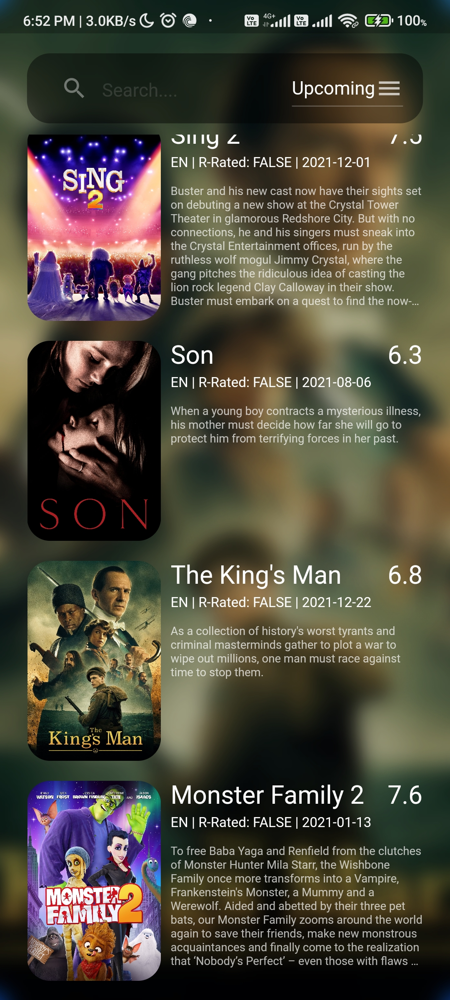
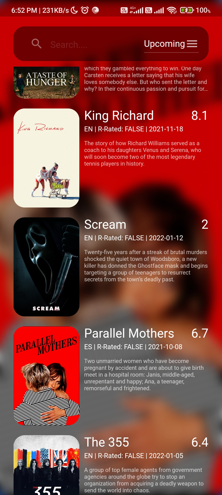
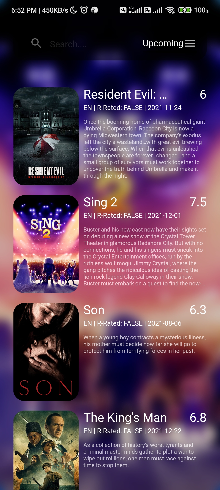

# moviefy

This is a single page flutter app for displaying popular and upcoming movies with a Rest API. 
`https://www.themoviedb.org`
The state of the app is managed by Flutter Riverpod package is a upgraded version of Provider.
___
### Features :
- Rest API
- Pagination
- Riverpod State Management
- Search based result
- Category based result
- Fetching data dynamically
 
 

 

